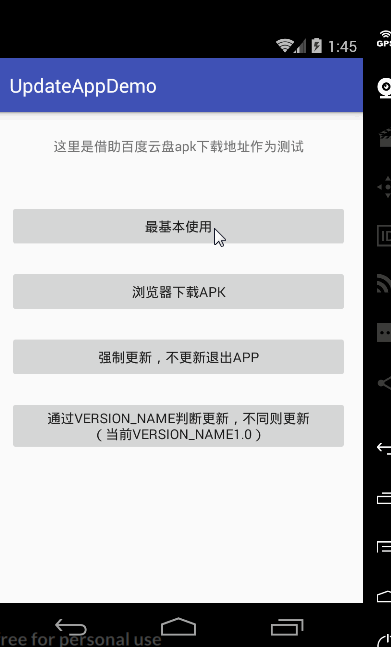

# UpdateAppUtils1.4
### 一行代码，快速实现app在线下载更新<br>  A simple library for Android update app





## 集成
compile引入
```
dependencies {
    compile 'com.teprinciple:updateapputils:1.4'
}
```

## 使用
更新检测一般放在MainActivity或者启动页上，
在请求服务器版本检测接口获取到versionCode、versionName、最新apkPath后调用。


#### 快速使用
```
 UpdateAppUtils.from(this)
                .serverVersionCode(2)  //服务器versionCode
                .serverVersionName("2.0") //服务器versionName
                .apkPath(apkPath) //最新apk下载地址
                .update();
```

#### Kotlin代码调用完全一样
```
   private fun update() {
        val apkPath:String = "http://issuecdn.baidupcs.com/issue/netdisk/apk/BaiduNetdisk_7.15.1.apk"

        UpdateAppUtils.from(this)
                .serverVersionCode(2)
                .serverVersionName("2.0")
                .apkPath(apkPath)
                .update()
    }

```


#### 更多配置使用
```
UpdateAppUtils.from(this)
                .checkBy(UpdateAppUtils.CHECK_BY_VERSION_NAME) //更新检测方式，默认为VersionCode
                .serverVersionCode(2)
                .serverVersionName("2.0")
                .apkPath(apkPath)
                .showNotification(false) //是否显示下载进度到通知栏，默认为true
                .updateInfo(info)  //更新日志信息 String
                .downloadBy(UpdateAppUtils.DOWNLOAD_BY_BROWSER) //下载方式：app下载、手机浏览器下载。默认app下载
                .isForce(true) //是否强制更新，默认false 强制更新情况下用户不同意更新则不能使用app
                .update();
```

#### 说明
```
    1、UpdateAppUtils提供两种更新判断方式

    CHECK_BY_VERSION_CODE:通过versionCode判断，服务器上versionCode > 本地versionCode则执行更新

    CHECK_BY_VERSION_NAME：通过versionName判断，服务器上versionName 与 本地versionName不同则更新

    2、UpdateAppUtils提供两种下载apk方式

    DOWNLOAD_BY_APP：通过App下载

    DOWNLOAD_BY_BROWSER：通过手机浏览器下载

```

#### 关于适配Android6.0、Android7.0

##### 适配Android7.0

1、注册provider
```
    <provider
            android:name="android.support.v4.content.FileProvider"
            android:authorities="${applicationId}.fileprovider"
            android:exported="false"
            android:grantUriPermissions="true">
            <meta-data
                android:name="android.support.FILE_PROVIDER_PATHS"
                android:resource="@xml/file_paths" />
    /provider>
```
2、新建file_paths.xml文件
```
<?xml version="1.0" encoding="utf-8"?>
<paths>
    <external-path path="Android/data/包名/"    name="files_root" />
    <external-path path="." name="external_storage_root" />
</paths>
```
可参见demo中的代码

如果你的版本没有适配到Android7.0 为了不进行上述操作，可以直接这样设置：

```
UpdateAppUtils.needFitAndroidN(false)
```


##### 适配Android6.0
关于6.0适配，请自行在调用API时申请WRITE_EXTERNAL_STORAGE权限，可以参考demo中的代码

#### 文章地址：[《UpdateAppUtils一行代码实现app在线更新》](http://www.jianshu.com/p/9c91bb984c85)


#### 更新日志
1.4<br>
使用[filedownloader](https://github.com/lingochamp/FileDownloader)替换DownloadManager，避免部分手机DownLoadManager无效，同时解决了重复下载的问题，且提高了下载速度<br>
增加接口UpdateAppUtils.needFitAndroidN(false)，避免不需要适配7.0，也要设置FileProvider<br>
<br>1.3.1<br>
修复部分bug，在demo中加入kotlin调用代码<br>
<br>1.3<br>
增加接口方法 showNotification(false)//是否显示下载进度到通知栏；<br>updateInfo(info)//更新日志信息；下载前WiFi判断。<br>
<br>1.2<br>
适配Android7.0，并在demo中加入适配6.0和7.0的代码<br>
<br>1.1<br>
适配更多SdkVersion